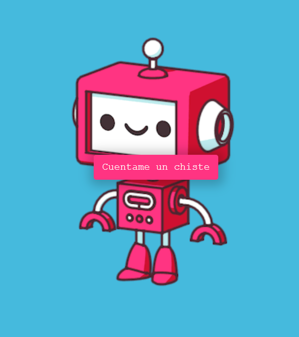

# Joke Teller 😂

Here are some jokes that will get you a laugh every time... if you can understand spanish. 

This project uses the VoiceRSS api to tell you a good joke in spanish accent.

# Motivation

This idea came out from [JavaScript Web Projects: 20 Projects to Build Your Portfolio](https://academy.zerotomastery.io/p/javascript-projects)  
Project 3 of 20

# Screenshot



# Tools
* [React](https://es.reactjs.org/) - Library for UI
* [Voice RSS](http://www.voicerss.org/) - Audio API for telling jokes
* [Ortograph](https://github.com/jleahred/ortograph) - Spanish jokes dataset

# Deployment

[Vercel](https://joke-teller-five.vercel.app/)

# To run this app
1. Clone this repo
2. Run ```npm install```
3. Run ```npm start```
